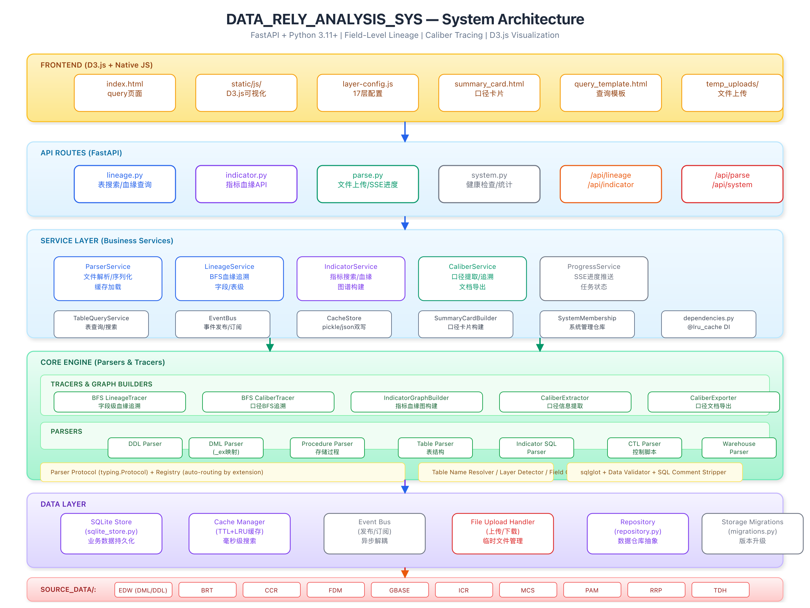

# Demo: field-level lineage in 30 seconds

This page is the reviewer-facing demo entry point. It explains what the project does without requiring access to private enterprise SQL assets.

## What it does

The system parses Oracle and enterprise data warehouse SQL, builds field-level lineage, and renders the result as an interactive graph for governance, impact analysis, and audit review.


## Core scenario

Given a target field such as `ICL.CUSTOMER_DAILY_SNAPSHOT.CUSTOMER_TIER`, the analyzer can trace where the value comes from, which upstream tables contribute to it, and which transformation expression produced it.


## Architecture overview



Pipeline:

1. Source SQL, procedure, control, and spreadsheet files are discovered from configured data sources.
2. Parser registry routes each file to the correct parser.
3. Parse results are cached and indexed.
4. Lineage, caliber, and indicator services answer API queries.
5. The frontend renders the graph with D3.js.

## Run it locally

```bash
python3.11 -m venv .venv
source .venv/bin/activate
python3.11 -m pip install -r requirements.txt
python3.11 run_app.py
```

Open `http://localhost:8899/static/index.html`.

## Safe public sample

- SQL: [`examples/oracle_warehouse_lineage.sql`](examples/oracle_warehouse_lineage.sql)
- Output: [`examples/lineage_query_output.json`](examples/lineage_query_output.json)
