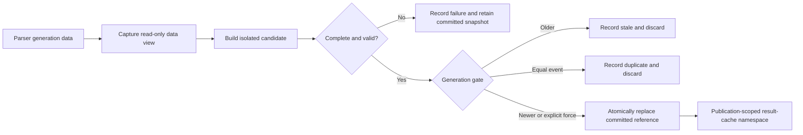
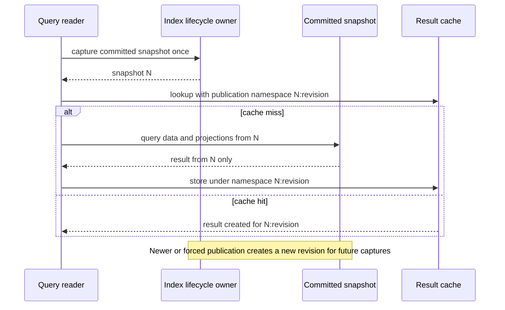

# Index Snapshot Lifecycle Consolidation - Plan

## Goal Capsule

- **Objective:** Establish one lifecycle owner for every query-index state and make each data generation visible through one complete, immutable query snapshot.
- **Product authority:** The user-confirmed Product Contract governs availability, consistency, migration gates, and exclusions. The Planning Contract governs implementation choices that preserve it.
- **Open blockers:** None. Deferred implementation details do not change behavior, scope, or readiness.

---

## Product Contract

### Summary

Consolidate the search index, table adjacency graph, lineage query index, and their exact source-data view behind one immutable query snapshot per data generation. One lifecycle owner builds, validates, and atomically publishes each snapshot while readers continue using the last committed snapshot.

The mutable TTL/LRU result cache remains outside the snapshot and is isolated by generation. The unused `_transitive_cache` state is removed rather than promoted into the new design.

### Problem Frame

Query-index state currently has overlapping owners. `LineageService` subscribes to data and cache events, owns multiple index structures, and can rebuild them through event, explicit, and modification-time paths. `IndexService` subscribes to the same events and rebuilds a subset of the same state, but it is not wired as the production owner.

The current event bus invokes subscribers independently and continues after subscriber failures. It therefore cannot guarantee that all query indexes become visible as one generation or that a failed rebuild leaves every reader on the previous generation. `LineageService` also reads index state and `ParserService.get_current_data()` separately, so atomically replacing only index references would still permit a query to combine different generations.

This overlap makes a file-level split insufficient: code may move while mutable state, refresh rules, cache invalidation, and failure behavior remain coupled and duplicated.

### Key Decisions

- **One owner for all query-index state.** The search index, table adjacency graph, lineage query index, and captured source-data view share one lifecycle boundary and one committed generation.
- **Immutable snapshot publication.** A new snapshot is built outside the currently visible state and becomes readable only after the complete snapshot passes validation.
- **Availability through the last committed generation.** A failed build does not interrupt queries or partially publish new state; readers stay on the previous snapshot while the failure remains observable.
- **Result cache outside the snapshot.** The active TTL/LRU cache remains mutable and generation-scoped; the unused `_transitive_cache` is deleted. `session-settled: user-approved`
- **Explicit rebuild can force the current generation.** Event-driven refreshes deduplicate the committed generation, while an authenticated administrator can intentionally rebuild it. `session-settled: user-approved`
- **Parse and projection outcomes remain distinct.** Event-driven projection failure preserves the old snapshot and records failure; an explicit administrator rebuild reports failure to its caller. `session-settled: user-approved`
- **Tracer lifecycle stays separate.** Parser and `TracerFactory` continue to own tracer-object invalidation and recreation. Snapshot-backed field queries receive a generation-matched read-only tracing view during candidate construction instead of fetching a live tracer mid-query.
- **Dual ownership is transitional only.** Shadow construction and comparison are allowed during migration, but the old production path must be removed after the equivalence gate passes.

### Actors

- A1. **Refresh initiator:** Produces or requests a data generation and needs a definitive refresh outcome appropriate to the trigger.
- A2. **Query reader:** Executes search, lineage, or export queries and must observe one complete committed generation.
- A3. **Index lifecycle owner:** Builds, validates, publishes, and retires query snapshots.
- A4. **Maintainer:** Uses tests and diagnostics to decide whether the legacy owner can be removed safely.

### Requirements

**Ownership and snapshot boundary**

- R1. Exactly one production lifecycle owner must be allowed to build or replace query snapshots.
- R2. One snapshot must contain every immutable query projection in scope: the captured source-data view, search indexes, table adjacency graphs, lineage query index, and a generation-matched field-lineage tracing view supplied by Parser/TracerFactory.
- R3. Every committed snapshot must identify the data generation from which it was built and provide a unique cache namespace for that publication.
- R4. Query services must consume one captured committed snapshot without mutating its contained data or index state.

**Consistency, cache, and failure behavior**

- R5. A candidate snapshot must be built without changing the snapshot currently visible to query readers.
- R6. Publication must expose all in-scope state for the new generation as one atomic visibility change.
- R7. A failed build or validation must discard the candidate and keep the previous committed snapshot available.
- R8. No query may combine data, index state, or cached results from different generations.
- R9. Event notifications for an already committed generation must not rebuild or republish it; an authenticated explicit rebuild may force a fresh candidate for that same generation.
- R10. A candidate whose generation is older than the committed generation must never publish, even if it finishes later.
- R11. The TTL/LRU result cache must remain outside the immutable snapshot and must key entries by the committed snapshot's namespace. That namespace must change for a forced same-generation publication as well as a newer generation. The unused `_transitive_cache` must be removed.

**Migration and compatibility**

- R12. Migration must compare legacy and candidate behavior on the same representative inputs before production ownership changes.
- R13. Equivalence comparison must cover search results, table traversal, lineage query results, exports, and generation metadata after non-semantic ordering is normalized.
- R14. The legacy index owner may be removed only after equivalence passes, failure fallback passes, the full regression suite passes, and no production caller uses the legacy refresh path.
- R15. Public API response shapes and existing query semantics must remain unchanged throughout the migration.
- R16. The finished system must not retain a runtime switch that restores the legacy index owner.

**Observability and lifecycle**

- R17. Refresh outcomes must distinguish publication, coalesced or duplicate generation, stale or superseded request, candidate failure with previous snapshot preserved, and forced same-generation publication.
- R18. Diagnostics must expose readiness, committed generation, last refresh outcome, and sanitized last failure metadata without exposing source data, paths, credentials, or raw exception text.
- R19. Parsing success and projection publication success must remain distinct: event-driven failure is recorded without relabeling the parse result, while explicit rebuild failure is returned to the administrator.
- R20. Lifecycle subscription and shutdown must be idempotent so one production owner subscribes once and isolated tests do not accumulate global event handlers.

### Key Flows

- F1. **Successful generation refresh**
  - **Trigger:** A1 makes a newer data generation available.
  - **Actors:** A1, A3, A2
  - **Steps:** A3 captures the generation data once, builds and validates a complete candidate while A2 reads the previous snapshot, then publishes the candidate once if it is still newer.
  - **Outcome:** Every query started after publication reads the new committed generation; already-started queries finish on their captured older snapshot.
  - **Covered by:** R1–R8, R10–R11, R17–R20

- F2. **Failed generation refresh**
  - **Trigger:** Candidate construction or validation fails.
  - **Actors:** A3, A2, A4
  - **Steps:** A3 discards the candidate, preserves the committed snapshot, records a sanitized failure, and returns failure only when the trigger is an explicit administrator rebuild.
  - **Outcome:** Queries remain available on one complete older generation and no candidate state becomes visible.
  - **Covered by:** R5–R8, R17–R20

- F3. **Duplicate, forced, or stale refresh**
  - **Trigger:** A refresh targets the committed generation, or an older candidate completes after a newer publication.
  - **Actors:** A1, A3, A4
  - **Steps:** A3 ignores duplicate event refreshes, permits authenticated explicit force rebuilds, and rejects candidates older than the committed generation at publication time.
  - **Outcome:** Generation never regresses; intentional administrator repair remains available without turning duplicate events into rebuild work.
  - **Covered by:** R9–R10, R17, R19

- F4. **Legacy-owner cutover**
  - **Trigger:** A4 proposes moving production ownership to the new lifecycle boundary.
  - **Actors:** A3, A4
  - **Steps:** Legacy and candidate paths run against the same captured data; normalized results are compared; production callers move only after the exit gate passes.
  - **Outcome:** The legacy refresh path and duplicate state owner are deleted rather than retained as permanent fallback.
  - **Covered by:** R12–R16, R20

### Acceptance Examples

- AE1. **Covers R4–R8.** Given generation N is committed and N+1 is building, when queries execute before publication, every query uses only N; after publication, every newly started query uses only N+1.
- AE2. **Covers R7–R8, R17–R19.** Given generation N is committed, when any N+1 component fails to build or validate, the candidate is discarded, queries continue on N, the failure is observable, and an explicit caller receives failure.
- AE3. **Covers R2, R6.** Given most N+1 components build successfully but one is incomplete, when publication is considered, no N+1 component becomes visible.
- AE4. **Covers R9, R17.** Given generation N is committed, when a duplicate event for N arrives, no rebuild occurs; when an authenticated administrator forces N, a fresh valid snapshot may publish with a forced outcome.
- AE5. **Covers R10, R17.** Given an N+1 candidate builds slowly and N+2 commits first, when N+1 later reaches publication, it is discarded as stale and the committed generation remains N+2.
- AE6. **Covers R8, R11.** Given a cached lineage result exists for a committed snapshot, when a newer-generation or forced same-generation snapshot publishes, a query on the new publication cannot read the prior result even if the logical query key and data generation are identical.
- AE7. **Covers R12–R15.** Given representative source data, when legacy and candidate paths are compared, normalized search, traversal, lineage, export, and public API results are equivalent.
- AE8. **Covers R14, R16, R20.** Given equivalence and regression gates pass and production caller count is zero, when cutover completes, the legacy build, subscriptions, mutable state, and refresh path are removed with no runtime fallback switch.
- AE9. **Covers R18.** Given a valid dataset with zero lineage edges commits, health reports a ready committed snapshot rather than inferring unreadiness from an empty adjacency graph.

### Success Criteria

- All immutable query state in scope has one production write owner and one committed generation at runtime.
- Concurrency and failure tests cannot observe a mixed-generation query result, partially published candidate, or generation regression.
- Existing search, lineage, export, state-consistency, storage, and health behaviors remain passing.
- New equivalence and failed-refresh tests prove migration behaviors not covered by the existing suite.
- Production call-site inspection finds no legacy index build, mutable adjacency reset, or duplicate event subscription after cutover.

### Scope Boundaries

- Tracer-object invalidation and recreation remain owned by Parser and `TracerFactory`.
- Parser orchestration, SQL parsing, domain-model splitting, API redesign, and frontend changes are outside this refactor.
- The work does not introduce a general projection framework, event-sourcing system, new persistence layer, distributed service, or content-addressed data diffing.
- Long-term dual execution and a permanent legacy fallback switch are outside the accepted design.
- Broader decomposition of `LineageService` may follow only after this state-ownership boundary is established.

### Deferred to Follow-Up Work

- Move unrelated exports, graph assembly helpers, and presentation-specific transformations out of `LineageService` after the new ownership boundary is stable.
- Consider finer-grained cache invalidation only if generation-wide isolation becomes a measured performance problem.

### Dependencies and Assumptions

- Parser generation remains monotonic. The lifecycle owner requires one atomic parser capture that returns a matching generation and complete data view rather than reading those values separately.
- Capturing a generation data view may use a defensive immutable copy or an equivalent read-only representation, but it must not share mutable builder state with later parser updates.
- Existing API responses remain authoritative; observability additions use existing health fields where compatible and internal structured diagnostics otherwise.
- Empty parsed data and a valid zero-edge parsed dataset are different states: the first may have no committed snapshot, while the second is a ready snapshot.

### Product Contract Preservation

Changed with user approval: R2 now binds the captured data view to the snapshot; R9 distinguishes event deduplication from forced administrator rebuild; R10–R11 and R17–R20 make stale-candidate, cache, failure, diagnostics, and subscription semantics explicit. The original objective, migration gates, API compatibility, tracer exclusion, and broader-refactor exclusions are unchanged.

### Sources and Research

- `app/services/lineage_service.py` — current production ownership, mixed parser/index reads, event subscriptions, modification-time refresh, readiness, and explicit rebuild paths.
- `app/services/index_service.py` — extracted but unwired overlapping lifecycle implementation.
- `app/services/parser_service.py` — monotonic generation publication and tracer invalidation boundary.
- `app/services/event_bus.py` — subscriber isolation behavior; it cannot serve as an atomic commit protocol.
- `app/utils/cache_manager.py` — mutable TTL/LRU result cache combined with mutable search-index responsibility.
- `app/dependencies.py`, `app/main.py`, `app/api/lineage.py`, and `app/api/system.py` — production composition, startup, health, and rebuild entry points.
- `tests/test_state_consistency.py`, `tests/test_node_field_metadata.py`, `tests/test_repository_search.py`, `tests/test_lineage_api.py`, `tests/test_system_api.py`, and `tests/test_system_lineage_export.py` — current behavior baselines and migration test seams.
- `docs/ideation/2026-07-14-architecture-decoupling-ideation.html` — ranked ownership-first architecture direction and rejected broader alternatives.

---

## Planning Contract

### Summary

Promote the existing `IndexService` seam into the sole lifecycle owner, but replace its current in-place clearing and rebuilding with isolated candidate construction and one committed snapshot reference. Query methods capture that reference once and obtain both data and projection state from it. `LineageService` remains the public orchestration surface during this slice but stops owning index lifecycle state.

### Key Technical Decisions

- **KTD1 — A snapshot is the consistency boundary.** `session-settled: user-approved`  
  Each snapshot binds generation metadata, a unique publication/cache namespace, a read-only source-data view, search projection, table adjacency projection, and `LineageQueryIndex`. Parser generation and data must be captured as one atomic pair; reading them separately would allow a candidate to be mislabeled during concurrent parsing. Minimum validation proves that capture binding, every required projection's completion, structural resolvability under existing table-name tolerance, and absence of shared mutable builder references. Empty collections are valid only when the captured parser state represents a real parsed dataset. A snapshot exposes query-oriented read operations and does not expose builders or mutable backing collections.

- **KTD2 — Publication swaps one reference under a short synchronization boundary.**  
  Candidate construction and validation occur outside the publication lock. Publication compares candidate and committed generation, request order, and lifecycle epoch, then replaces one coherent owner-state reference containing snapshot plus committed metadata. Equal generation is a duplicate unless the build was explicitly forced; lower generation is stale. Event refreshes for the same target generation are single-flight/coalesced. Explicit forced refreshes are serialized, and a force request superseded by a newer committed generation cannot publish. Existing readers retain their captured object, so retirement requires no in-place clearing or reader coordination.

- **KTD3 — Force controls build eligibility, not generation ordering.** `session-settled: user-approved`  
  An authenticated explicit rebuild may construct and publish a new snapshot for the committed generation. It may not publish an older generation or bypass validation. Event and post-reparse compatibility paths do not force and therefore deduplicate. `CACHE_INVALIDATED` may invalidate result entries but cannot invent a data generation. A retained modification-time detector must request data reload through `ParserService`, which atomically publishes a new generation, rather than directly rebuilding projections from same-generation data.

- **KTD4 — Result caching remains mutable and publication-scoped.** `session-settled: user-approved`  
  TTL/LRU entries stay outside the snapshot because lookup, insertion, expiry, and eviction are mutations. Each committed snapshot supplies a cache namespace containing its generation plus a publication revision or equivalent identity. A forced same-generation rebuild therefore cannot reuse results from the replaced snapshot. Publication may eagerly clear old entries for memory control, but correctness cannot depend on clearing. Search indexing is extracted from `CacheManager` into the immutable snapshot so the result-cache object no longer participates in projection publication.

- **KTD5 — Refresh outcomes are explicit owner state, not EventBus transactions.** `session-settled: user-approved`  
  The owner records each attempt with an attempt identifier, target generation, base committed namespace, completion time, and structured outcome for publication, coalesced or duplicate work, stale or superseded work, forced publication, or failed candidate. Committed snapshot metadata is separate from last-attempt diagnostics, so a late stale or failed build cannot overwrite the identity or readiness of a newer successful commit. The event bus remains best-effort notification infrastructure. Parser success is not rewritten when an event subscriber fails; the explicit rebuild surface converts a failed owner outcome into its existing administrator-facing error contract.

- **KTD6 — Readiness means a validated committed snapshot exists.**  
  Adjacency may legitimately be empty, so collection non-emptiness is not a readiness test. Startup with no parsed data may remain available in the current degraded/empty behavior. When parsed data exists and the first candidate build raises or fails validation, startup remains fatal as it is today; the "preserve previous snapshot" availability rule applies only after a valid snapshot has committed. A committed empty-edge dataset is ready.

- **KTD7 — Migration uses a bounded shadow equivalence gate.**  
  Legacy and candidate projections build from the same captured input. Comparators sort unordered nodes, edges, mappings, and search results by stable semantic keys; retain ordering where public behavior relies on it; and ignore timing, cache-hit, and other nondeterministic metadata. Shadow execution is test/migration instrumentation, not a permanent production mode.

- **KTD8 — Ownership cutover includes lifecycle teardown.**  
  Dependency composition creates one singleton owner, subscribes it once, and closes it at shutdown. Closing advances a lifecycle epoch or equivalent closed gate: already-running candidates may finish cleanup but cannot publish or rewrite owner diagnostics after close. The final cut removes legacy event handlers, direct mutable resets, modification-time rebuilding, and dead `_transitive_cache` state; it does not retain a fallback switch.

- **KTD9 — Snapshot-backed field tracing never fetches a live tracer.**  
  Parser/`TracerFactory` remains responsible for constructing and invalidating tracer objects, but candidate construction obtains a read-only tracing view bound to the same atomic generation/data capture. The committed snapshot holds that opaque query collaborator. `LineageService` does not call `get_lineage_tracer()` or another live tracer factory during a snapshot-backed query.

### High-Level Technical Design

#### Snapshot build and atomic publication

#### Reader consistency sequence

#### Lifecycle state model

```mermaid
stateDiagram-v2
  [*] --> Empty
  Empty --> Ready: first valid candidate publishes
  Empty --> EmptyFailed: first candidate fails
  EmptyFailed --> Ready: later candidate publishes
  Ready --> Ready: duplicate or stale candidate ignored
  Ready --> Ready: candidate fails; previous snapshot retained
  Ready --> Ready: newer or forced candidate publishes
```

### Resolved During Planning

- Snapshot source data and generation are captured atomically and built with indexes so a query cannot mix parser data and projection generations.
- `_transitive_cache` is dead state and will be removed; the active TTL/LRU result cache remains external and generation-scoped.
- Only authenticated explicit rebuild bypasses same-generation deduplication.
- Event-driven refresh failure preserves the previous snapshot and records diagnostics; explicit rebuild failure is returned to the caller.
- Stale candidates are rejected at publication time, even when they began before the currently committed build.
- Readiness is based on a validated committed snapshot rather than non-empty adjacency.
- Modification-time or cache-invalidated compatibility signals cannot directly rebuild same-generation projections; real data replacement must pass through Parser and produce a new atomic generation/data capture.
- Closing the lifecycle owner prevents already-running candidates from publishing after shutdown.

### Deferred Implementation Details

- Choose the smallest read-only representation that preserves existing dictionary-based query behavior without leaking mutable builder collections.
- Choose the smallest generation-bound field-tracing view that preserves current field-lineage performance and semantics without moving tracer invalidation ownership out of Parser/`TracerFactory`.
- Choose exact internal names for snapshot, publication namespace, builder, validation error codes, and refresh outcome types according to existing service conventions.
- Decide whether successful publication eagerly clears old-generation result entries for memory reclamation; correctness must remain generation-key based.
- Determine whether the existing health payload can carry additive sanitized diagnostics without breaking typed consumers; otherwise keep detailed owner diagnostics internal and expose only current compatible readiness fields.

### System-Wide Impact

- **Parser boundary:** `ParserService` remains the generation authority and tracer invalidation owner. Its event emission triggers refresh but does not become a transaction coordinator.
- **Tracer boundary:** Parser/`TracerFactory` supplies a generation-matched tracing view during candidate construction. Standalone caliber/edge APIs remain Parser-owned unless they combine their result with snapshot state; snapshot-backed field lineage never fetches a live tracer after entry.
- **Query boundary:** `LineageService` and `TableQueryService` search, graph traversal, field lineage, metadata, statistics, and export operations must capture one snapshot at entry when they use snapshot-owned data or projections. Helper calls must receive or close over that capture rather than fetch parser data again.
- **Cache boundary:** result-cache keys become generation-aware. Search projection leaves `CacheManager`; callers that use search indexes move to the snapshot owner before legacy search-index methods are removed.
- **Startup and shutdown:** the composition root creates the owner after parser data is available, verifies whether a committed snapshot exists, and closes event subscriptions during lifespan shutdown.
- **Administrator paths:** explicit cache/index rebuild forces the current generation, creates a new publication/cache namespace, and propagates candidate failure through the existing protected endpoint contract. Force reparse relies on the new generation event and must not unintentionally force a redundant second build.
- **Health and diagnostics:** health distinguishes no snapshot from a valid zero-edge snapshot. Full exception text remains server-log-only; public or structured state uses sanitized component/error metadata.
- **Testing:** tests that construct `LineageService` via `__new__` and private state must move toward explicit snapshot/owner fixtures so the refactor reduces, rather than relocates, test coupling.

#### Reader scope matrix

- **Migrate to committed snapshots:** all `LineageService` data/search/lineage/export/statistics reads; all `TableQueryService` search, metadata, fields, system-membership, and statistics reads; direct lineage API table/field readers; health data-loaded, counts, generation, and index-readiness fields.
- **Remain Parser-owned:** parse task status, raw parse/reparse orchestration, storage loading, tracer creation/invalidation, and parser diagnostics that do not combine with snapshot readiness.
- **Rule:** an endpoint may remain Parser-owned only when its response does not combine parser state with snapshot-owned projections or committed-generation metadata.

### Risks and Mitigations

- **Hidden reader bypass:** a helper may continue calling `ParserService.get_current_data()` after capturing a snapshot. Mitigate with call-site inventory, mixed-generation concurrency tests, and a final search for direct reads in migrated query paths.
- **Mislabeled parser capture:** separately reading generation and current data could bind N metadata to N+1 data during concurrent parses. Mitigate with one parser capture operation guarded by the existing result-state synchronization boundary and a race-focused test.
- **Shallow immutability:** a frozen outer object could still expose mutable nested dictionaries and sets. Mitigate by keeping builders private, exposing query methods/read-only views, and testing that candidate construction or later parser mutation cannot alter the committed snapshot.
- **Search behavior drift:** extracting search indexing from `CacheManager` may change tokenization, limit behavior, or ordering. Mitigate with current repository-search characterization tests and normalized shadow comparison while preserving public ordering where asserted.
- **Memory overlap during builds:** committed and candidate snapshots coexist, and older readers may retain prior snapshots briefly. Mitigate by building only required projections, avoiding redundant deep copies beyond the data capture contract, and measuring representative build memory before removing the legacy path.
- **Event subscription leaks:** global handlers can accumulate across tests or repeated lifecycle starts. Mitigate with idempotent start/close and explicit unsubscribe coverage.
- **Shutdown publication race:** unsubscribing does not cancel a handler already executing. Mitigate with a closed/lifecycle-epoch publication gate and a test that closes the owner while candidate construction is paused.
- **Diagnostic regression:** a late stale or failed attempt can finish after a newer success. Mitigate by separating committed metadata from attempt history and testing that late completion does not regress readiness or committed identity.
- **False cutover confidence:** normalized comparison can hide semantic differences if it strips too much. Mitigate by limiting normalization to unordered collections and nondeterministic metadata, retaining externally visible ordering, limits, truncation, redirects, and error semantics.
- **Live-tracer bypass:** field-lineage helpers can silently escape the snapshot by asking Parser for its newest tracer. Mitigate with a generation-bound tracing view, a mixed-generation pause test, and a final call-site gate prohibiting live tracer fetches in snapshot-backed readers.

### Delivery Sequence

1. Characterize existing public behavior and define the isolated snapshot boundary.
2. Implement lifecycle publication and failure semantics without moving production callers.
3. Move readers and result-cache isolation to the committed snapshot.
4. Prove legacy/candidate equivalence and concurrency safety.
5. Switch production composition and administrator entry points.
6. Remove duplicate ownership and verify no legacy production path remains.

---

## Implementation Units

### U1. Characterize the legacy behavior and define snapshot contracts

**Goal:** Establish test-backed public behavior and a query-oriented snapshot abstraction that binds one source-data view to all immutable projection components.

**Requirements:** R2–R4, R8, R12–R13; F1, F4; AE1, AE7.

**Dependencies:** None.

**Files:**

- Create `app/services/index_snapshot.py`
- Modify `app/services/parser_service.py`
- Modify `app/services/lineage_query_index.py`
- Modify `app/services/table_lineage_tracer.py`
- Create `tests/test_index_snapshot.py`
- Modify `tests/test_repository_search.py`
- Modify `tests/test_node_field_metadata.py`

**Approach:** Define an immutable-by-interface snapshot containing generation, publication namespace, captured source data, search projection, adjacency projection, lineage query projection, and an opaque generation-matched field-tracing view supplied by Parser/`TracerFactory`. Candidate builders create fresh, non-exported component state. Preserve existing search tokenization, name resolution, traversal direction, limits, and ordering contracts before changing production ownership. Do not move result caching or tracer invalidation ownership into this abstraction.

**Execution note:** Add characterization coverage around legacy search and lineage behavior before replacing the state owner.

**Patterns to follow:** `DataChangedEvent` for immutable generation metadata; `LineageQueryIndex` and `TableLineageTracer` for existing projection semantics; `tests/test_repository_search.py` for externally visible search assertions.

**Test scenarios:**

1. Build a snapshot from generation N data containing tables, procedures, table edges, and field mappings; assert every read API reports N and returns the same semantic results as the current projection helpers.
2. Build a valid generation N snapshot with no lineage edges; assert it is complete and queryable rather than treated as unready.
3. Mutate the original builder input after candidate completion; assert the committed snapshot's data and projection results do not change.
4. Attempt to mutate collections returned through snapshot read APIs; assert backing projection state is not altered.
5. Covers F4 / AE7. Run existing exact-name, partial-name, schema-qualified, limit, and no-match search cases through legacy and snapshot search; assert equivalent results, preserving ordering where existing tests require it.
6. Race parser replacement against snapshot capture; assert every returned capture pairs generation N with N data or generation N+1 with N+1 data, never a mixed pair.
7. Obtain a field-tracing view for the capture, advance Parser to N+1, and assert the N view continues to return only N chains and mappings.

**Verification:** The snapshot can be built and queried without touching the current `LineageService` fields, and characterization tests describe every public behavior the later cutover must preserve.

### U2. Make IndexService the atomic snapshot lifecycle owner

**Goal:** Replace in-place clearing/rebuilding with isolated candidate builds, atomic publication, explicit refresh outcomes, and idempotent subscription lifecycle.

**Requirements:** R1, R3, R5–R7, R9–R10, R17–R20; F1–F3; AE1–AE5, AE9.

**Dependencies:** U1.

**Files:**

- Modify `app/services/index_service.py`
- Modify `app/services/event_bus.py`
- Create `tests/test_index_snapshot_lifecycle.py`
- Modify `tests/test_state_consistency.py`

**Approach:** Let the owner obtain one atomic parser generation/data capture and its matched field-tracing view, build a complete candidate outside the publication lock, validate the minimum invariants from KTD1, then publish one coherent owner-state reference subject to generation, request-order, and lifecycle-epoch gates. Every successful publication receives a new cache namespace, including forced equal-generation publication. Coalesce duplicate event work per target generation and serialize forced rebuilds; every explicit caller receives its own outcome rather than reading shared diagnostics after the fact. Record committed metadata separately from structured, sanitized attempt outcomes. EventBus handler registration/removal and publish snapshots become thread-safe, while the owner-side closed gate remains authoritative. A force flag never permits stale publication or validation bypass.

**Technical design:** Directional publication rule: when no snapshot is committed, any valid candidate generation may publish; a newer candidate replaces the committed reference; an equal candidate publishes only when explicit force is true; an older candidate is always stale. Build failure changes diagnostics, never the committed reference.

**Patterns to follow:** `ParserService.data_generation` monotonicity; `EventBus.unsubscribe()` for teardown; dependency singletons in `app/dependencies.py` for eventual production ownership.

**Test scenarios:**

1. Covers F1 / AE1. Hold a generation N reader while N+1 publishes; assert the held reader completes on N and a later capture returns N+1.
2. Covers F2 / AE2. Inject failure into each candidate component build and validation stage; assert the candidate is discarded, N remains committed, and the outcome identifies failure without raw source data or exception details.
3. Covers AE3. Complete all but one required component; assert publication is rejected and no partial state is visible.
4. Covers F3 / AE4. Publish N, send a duplicate N event, and assert no candidate build occurs; force N explicitly and assert a new valid snapshot reference publishes with a forced outcome.
5. Covers F3 / AE5. Delay N+1, publish N+2, then release N+1; assert N+1 is classified stale and generation never regresses.
6. Let N+1 fail after N+2 has published; assert committed generation/readiness remains N+2 while attempt diagnostics retain the late N+1 failure without relabeling the commit.
7. Start and close the owner repeatedly; assert each event is handled once while active and never after close.
8. Pause candidate construction, close the owner, then release construction; assert the candidate cannot publish or overwrite diagnostics after close.
9. Start with no parser data and assert current degraded/empty readiness behavior; start with parsed data whose first candidate fails and assert startup fails; publish a valid zero-edge dataset and assert readiness becomes true.
10. Send concurrent duplicate events for uncommitted N+1; assert one build runs and each attempt receives a deterministic coalesced or publication outcome.
11. Send concurrent forced rebuilds for N and race a force-N request with N+1; assert forced work is serialized, request-local outcomes are correct, and no older or superseded request overwrites a newer commit.
12. Read health/owner state concurrently with publication; assert snapshot, committed generation, namespace, and readiness always come from one coherent state.

**Verification:** Concurrency and failure tests prove one-reference publication, monotonic generation, previous-snapshot availability, distinct outcomes, and leak-free event subscription behavior.

### U3. Move LineageService readers and result caching onto one captured snapshot

**Goal:** Make each in-scope query consume one snapshot publication end to end while keeping the mutable TTL/LRU result cache outside the snapshot.

**Requirements:** R4, R8, R11, R15; F1–F2; AE1–AE2, AE6–AE7.

**Dependencies:** U1, U2.

**Files:**

- Modify `app/services/lineage_service.py`
- Modify `app/services/table_query_service.py`
- Modify `app/utils/cache_manager.py`
- Modify `tests/test_lineage_api.py`
- Modify `tests/test_system_lineage_export.py`
- Modify `tests/test_node_field_metadata.py`
- Modify `tests/test_state_consistency.py`
- Modify `tests/test_source_data_report_fixes.py`

**Approach:** Inject the lifecycle owner into `LineageService` and `TableQueryService`. At each in-scope public query entry, capture one committed snapshot and use its source data, search projection, adjacency, lineage query projection, and matched field-tracing view throughout helper calls. Never fall back to live parser data or a live tracer when no committed snapshot exists; preserve each endpoint's existing no-data empty/404 behavior instead. Add the snapshot's publication namespace to result-cache keys; optional eager cleanup is memory management only. A slow old-snapshot reader stores only under its captured namespace. Stop query-time modification checks from rebuilding projections. Verify that `_transitive_cache` has no active query behavior so U6 can remove it after the migration gates pass.

**Execution note:** Begin with a failing mixed-generation test that pauses a query between snapshot capture and publication.

**Patterns to follow:** Existing deep-copy behavior for cached results; current API tests for response compatibility; `tests/test_system_lineage_export.py` for generation metadata and export semantics.

**Test scenarios:**

1. Covers F1 / AE1. Pause a lineage query after it captures N, publish N+1 with different tables and mappings, resume the query, and assert every node, edge, mapping, and generation-dependent field comes only from N.
2. Covers AE6. Populate a result for snapshot N, publish N+1, execute the identical logical query, and assert the N cache entry is not returned; a second N+1 query may hit the N+1 entry.
3. Populate a result for generation N, force-publish a replacement snapshot for N, and assert the replacement namespace cannot read the prior snapshot's cache entry.
4. Query table/procedure search, table metadata, fields, system membership/statistics, table lineage, field lineage, alternate-schema redirect, and system export against a committed snapshot; assert existing response shapes, limits, and semantics are unchanged.
5. Trigger modification-time compatibility detection; assert any real reload passes through Parser and emits a new atomic generation/data capture before snapshot construction. Trigger cache invalidation without new data; assert it cannot force a same-generation projection rebuild.
6. Run queries with no committed snapshot; assert current empty/error behavior is preserved and no partial candidate is read.
7. Assert no production query path reads `_transitive_cache`, and its removal changes no observable result.
8. Pause a field-lineage query before tracing, publish N+1, and assert the query uses the N tracing view and returns only N chains/mappings.
9. Let a slow N reader store its result after N+1 or forced-N has published; assert the write remains under the old namespace and cannot contaminate the current publication.
10. Make parser data available while no snapshot has committed; assert in-scope readers preserve their existing no-data response rather than exposing unvalidated parser-only data.

**Verification:** A call-site audit and concurrency tests show migrated query paths capture one snapshot once; cached results cannot cross either generation or forced publication; existing query, lineage, and export API tests remain semantically unchanged.

### U4. Add bounded shadow equivalence and cutover gates

**Goal:** Prove candidate and legacy behavior match on the same captured inputs before changing production ownership.

**Requirements:** R12–R16; F4; AE7–AE8.

**Dependencies:** U1, U2, U3.

**Files:**

- Create `tests/test_index_snapshot_equivalence.py`
- Modify `tests/test_repository_search.py`
- Modify `tests/test_system_lineage_export.py`
- Modify `tests/test_lineage_api.py`
- Modify `tests/test_state_consistency.py`

**Approach:** Before deletion, build live legacy and candidate projections from one atomic captured dataset. Normalize only unordered collections and nondeterministic metadata. Compare search, short-name resolution, traversal, field and table lineage, redirects, limits, truncation, errors, exports, readiness, generation metadata, and cache-visible behavior. Convert verified legacy outcomes into test-owned characterization fixtures/assertions. After deletion, run the candidate against those expected outputs and public regressions; do not retain a production legacy builder solely so the comparator can keep running. Any short-lived runtime shadow hook must be removed at cutover.

**Patterns to follow:** Existing fixture shapes in lineage, repository-search, and export tests; stable semantic sort keys already used by API assertions and export assembly.

**Test scenarios:**

1. Covers F4 / AE7. Compare legacy and candidate results for representative Oracle and warehouse tables, procedures, table edges, field mappings, duplicate short names, empty data, and zero-edge data.
2. Normalize reversed set/dictionary iteration order and assert equivalent results compare equal while public ordered lists remain order-sensitive.
3. Change one semantic node, edge, mapping, resolved table, limit/truncation flag, or error outcome and assert the comparator reports the relevant mismatch.
4. Compare generation and readiness metadata, excluding timing and cache-hit fields only; assert a generation mismatch fails the gate.
5. Covers AE8. Encode the cutover gate as required tests: equivalence, failed-candidate fallback, mixed-generation concurrency, and legacy call-site absence must all pass before deletion is considered complete.
6. Compare no-snapshot errors, explicit rebuild failures, redirects, ordered/truncated results, `has_more`/partial indicators, generation, and publication namespace; assert only timing/cache-hit metadata and genuinely unordered collections are normalized.

**Verification:** The equivalence suite fails on deliberate semantic drift, passes on nondeterministic ordering only, and names the evidence required before production cutover.

### U5. Cut production composition and administrator paths to the owner

**Goal:** Wire one production owner through startup, queries, health, and rebuild entry points while preserving external API contracts.

**Requirements:** R1, R9, R15, R17–R20; F1–F4; AE2, AE4, AE8–AE9.

**Dependencies:** U2, U3, U4.

**Files:**

- Modify `app/dependencies.py`
- Modify `app/main.py`
- Modify `app/api/lineage.py`
- Modify `app/api/system.py`
- Modify `tests/test_app_config_routes.py`
- Modify `tests/test_lineage_api.py`
- Modify `tests/test_system_api.py`

**Approach:** Add a cached provider for the singleton lifecycle owner and inject it into `LineageService` and `TableQueryService`. Move direct lineage API data readers and health's data/index composition onto the owner so their responses reflect one committed snapshot. Startup builds or loads one committed snapshot after parser initialization: no data preserves current degraded behavior, while a failed first build with available parsed data remains fatal. The authenticated cache/index rebuild path forces the current generation, changes the publication/cache namespace, preserves the current success schema, and maps build/validation/no-data failure to a sanitized HTTP 500 without raw exception or path data; stale/superseded outcomes cannot be reported as success for that caller. Force reparse relies on the newly published parser generation; any compatibility rebuild call is non-forcing and therefore deduplicates. Lifespan cleanup runs in `finally`, closes the owner before parser shutdown, cleans partial startup subscriptions, and clears or recreates closed cached providers before a later lifespan.

**Patterns to follow:** Cached-provider failure cleanup in `get_parser_service()` and `get_lineage_service()`; existing `admin_required` authorization; lifespan startup failure propagation in `tests/test_app_config_routes.py`.

**Test scenarios:**

1. Start the application with parsed data; assert one lifecycle owner is created, one snapshot commits before readiness, and duplicate service resolution does not add event handlers.
2. Start with no data; assert health remains compatible and reports the index as not ready. Start with a valid zero-edge dataset; assert health reports ready.
3. Start with parsed data whose first candidate fails; assert lifespan propagates the initialization failure rather than serving without a committed snapshot.
4. Covers F3 / AE4. Call the authenticated explicit rebuild for the current generation; assert force publication occurs once and success response shape remains unchanged.
5. Inject explicit rebuild failure; assert the protected endpoint returns its existing failure contract while queries continue using the old committed snapshot.
6. Force reparse to generation N+1; assert the event publishes N+1 once and the route's follow-up compatibility call is ignored as a duplicate rather than forcing a second build.
7. Compare a health response while Parser has advanced to N+1 but snapshot N remains committed; assert data counts, generation, and readiness all describe committed N rather than mixing states.
8. Shut down lifespan while a candidate is building; assert the owner unsubscribes and neither the in-flight build nor a later event can publish through the closed instance.
9. Run two lifespan cycles in one process and inject a partial startup failure after owner subscription; assert cleanup occurs and the second cycle receives a live, singly subscribed owner rather than a closed cached instance.
10. Exercise explicit rebuild success, build failure, validation failure, no parser data, stale/superseded request, and authentication denial; assert request-local status/body behavior is sanitized and the prior snapshot remains queryable after failure.

**Verification:** Production DI exposes exactly one owner, startup/readiness and admin behavior are covered at API level, and explicit failure is visible without interrupting queries on the committed snapshot.

### U6. Remove legacy ownership and dead mutable state

**Goal:** Complete the migration by deleting every legacy production build/refresh path and obsolete mutable projection field after the gates pass.

**Requirements:** R1, R14, R16, R20; F4; AE8.

**Dependencies:** U4, U5.

**Files:**

- Modify `app/services/lineage_service.py`
- Modify `app/services/index_service.py`
- Modify `app/utils/cache_manager.py`
- Modify `tests/test_index_snapshot_equivalence.py`
- Modify `tests/test_state_consistency.py`
- Modify `tests/test_node_field_metadata.py`

**Approach:** Remove `LineageService` event subscriptions, direct index construction, adjacency clearing, generation tracking, modification-time projection rebuilding, and `_transitive_cache`. Remove the obsolete overlapping `IndexService` implementation paths superseded by its lifecycle-owner design. Remove search-index build responsibility from `CacheManager` only after all callers use snapshot search. Do not leave a runtime fallback flag, dormant owner, or duplicated refresh method.

**Execution note:** Perform deletion only after U4 and U5 gates pass; use final call-site searches as evidence, not as a substitute for tests.

**Patterns to follow:** Repository change guardrails for single-module commits; existing public facade methods may delegate to the owner temporarily only when needed for API compatibility, but must not retain write ownership.

**Test scenarios:**

1. Covers F4 / AE8. Inspect production call sites and assert no service other than the owner subscribes to projection-refresh events or constructs/replaces query projection state.
2. Assert no production code clears adjacency dictionaries, rebuilds `LineageQueryIndex`, or reads/writes `_transitive_cache` outside isolated candidate construction.
3. Assert no runtime setting or branch can restore the legacy owner.
4. Re-run candidate-versus-characterization fixtures, failure fallback, mixed-generation, search, lineage, export, health, and administrator rebuild tests after deletion; assert results remain unchanged without retaining the legacy production builder.
5. Construct services through supported fixtures rather than `__new__` private-state injection; assert tests no longer depend on removed layout.

**Verification:** Legacy production caller count is zero, dead state is absent, the new owner is the sole projection writer, and the complete regression contract still passes.

---

## Verification Contract

### Unit and Integration Gates

- Targeted snapshot contract, lifecycle, concurrency, cache-isolation, and equivalence tests pass.
- Existing state-consistency, node-field metadata, repository search, lineage API, system API, application lifespan, and system lineage export tests pass.
- Failure injection proves every candidate component fails closed onto the previous committed snapshot.
- Concurrency tests prove reader capture consistency and stale-candidate rejection rather than only checking final state.

### Repository Quality Gates

- `python3.11 -m pytest tests/`
- `ruff check app/ core/ tests/`
- `mypy app/ core/`
- `scripts/agent-verify.sh full`

### Structural Gates

- Production call-site search finds one projection event subscriber and one snapshot publication owner.
- Parser capture returns data and generation atomically, and production query paths in scope do not combine a captured snapshot with `ParserService.get_current_data()`.
- Snapshot-backed query paths do not call live `ParserService.search_tables()` or `get_*_tracer()` methods after capture.
- `CacheManager` retains TTL/LRU result caching but no longer owns search projection construction.
- `_transitive_cache`, direct adjacency clearing, legacy projection rebuilds, and fallback owner switches are absent.
- `LineageService`, `TableQueryService`, direct lineage API readers, and health use the committed owner state for every snapshot-owned datum they return.
- Public API schemas and response shapes remain unchanged; additive diagnostics are allowed only where existing compatibility permits them.

### Migration Exit Gate

Legacy ownership may be deleted only when all of the following hold together:

1. Normalized legacy/candidate semantic differences are zero on representative fixtures.
2. Failed candidate and stale candidate tests preserve the committed snapshot.
3. Mixed-generation and generation-scoped cache tests pass.
4. The full repository test and quality gates pass.
5. Production call-site inspection finds no caller of legacy build, clear, refresh, or subscription paths.

---

## Definition of Done

- R1–R20 and AE1–AE9 are covered by implementation units or explicit verification gates.
- One singleton lifecycle owner builds, validates, publishes, reports, and closes immutable query snapshots.
- Every migrated query captures one snapshot and uses its data and projections for the entire operation.
- Result-cache correctness is publication-namespace-keyed; old entries cannot answer newer-generation or forced same-generation queries even when eager cleanup is skipped.
- Duplicate events, forced equal-generation rebuilds, stale candidates, candidate failures, startup-without-data, and valid zero-edge datasets have distinct tested outcomes.
- Parser and tracer ownership remain unchanged, and no unrelated `LineageService` decomposition is included.
- Legacy subscriptions, builders, mutable resets, `_transitive_cache`, search-index responsibility in `CacheManager`, and fallback switches are removed after migration gates pass.
- Existing external API behavior remains compatible, with explicit administrator failure and sanitized internal diagnostics verified.
- All Verification Contract gates pass, and a fresh final diff review finds no unrelated changes or stale code introduced by the refactor.
