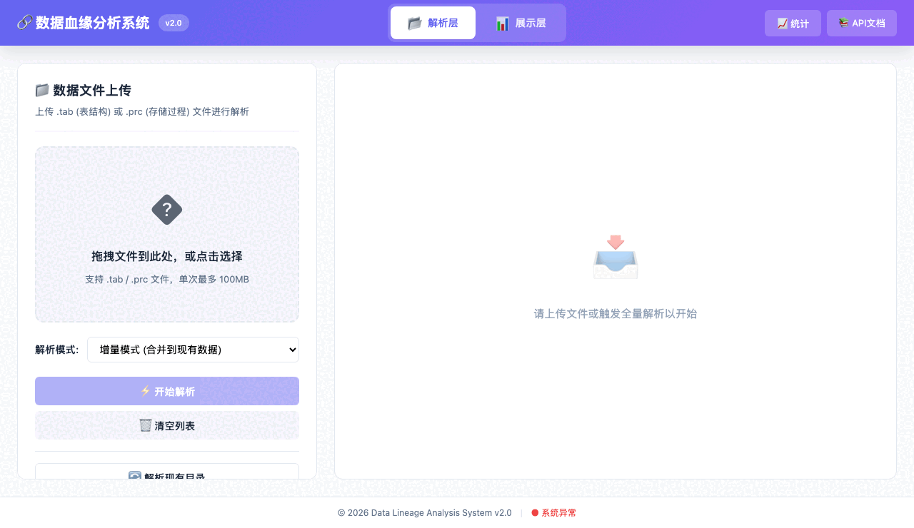
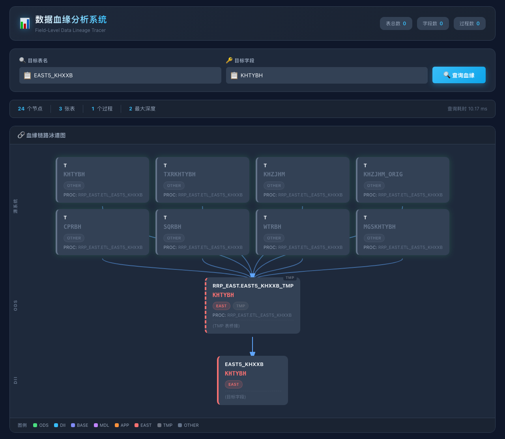

# Release v2.2.0

Language: [中文](v2.2.0.zh-CN.md) | English

Release date: 2026-07-08

## Summary

`v2.2.0` packages the project for open-source review: clearer English positioning, public demo assets, example SQL, example lineage output, and maintenance documents that make contribution, security, and roadmap expectations explicit.

## 30-second demo





The demo shows the core workflow:

1. Enter a target table and field.
2. Query upstream/downstream lineage.
3. Review the generated lineage graph with layer grouping, path edges, and node metadata.
4. Use the result as governance evidence for impact analysis and audit review.

## Install

```bash
git clone git@github.com:NickyLam/DATA_RELY_ANALYSIS_PLATFORM.git
cd DATA_RELY_ANALYSIS_PLATFORM

python3.11 -m venv .venv
source .venv/bin/activate
python3.11 -m pip install -r requirements.txt

python3.11 run_app.py
```

Open:

- Frontend: `http://localhost:8899/static/index.html`
- API docs: `http://localhost:8899/docs`

Force a clean parse when refreshing local data:

```bash
python3.11 run_app.py --reparse
```

## Example SQL

```sql
CREATE TABLE ICL.CUSTOMER_DAILY_SNAPSHOT AS
SELECT
    c.CUST_ID,
    c.CUST_NAME,
    a.ACCT_BALANCE,
    CASE WHEN a.ACCT_BALANCE > 100000 THEN 'VIP' ELSE 'STANDARD' END AS CUSTOMER_TIER
FROM IML.CUSTOMER_PROFILE c
LEFT JOIN IOL.ACCOUNT_BALANCE a
    ON c.CUST_ID = a.CUST_ID;
```

Full example: [`docs/examples/oracle_warehouse_lineage.sql`](../examples/oracle_warehouse_lineage.sql)

## Query example

```bash
curl -X POST http://localhost:8899/api/lineage/query \
  -H 'Content-Type: application/json' \
  -d '{
    "target_table": "ICL.CUSTOMER_DAILY_SNAPSHOT",
    "target_field": "CUSTOMER_TIER",
    "direction": "upstream"
  }'
```

## Output example

```json
{
  "target": {
    "table": "ICL.CUSTOMER_DAILY_SNAPSHOT",
    "field": "CUSTOMER_TIER"
  },
  "direction": "upstream",
  "summary": {
    "node_count": 4,
    "edge_count": 3,
    "max_depth": 2
  },
  "nodes": [
    {
      "id": "ICL.CUSTOMER_DAILY_SNAPSHOT.CUSTOMER_TIER",
      "table": "ICL.CUSTOMER_DAILY_SNAPSHOT",
      "field": "CUSTOMER_TIER",
      "layer": "ICL"
    },
    {
      "id": "IOL.ACCOUNT_BALANCE.ACCT_BALANCE",
      "table": "IOL.ACCOUNT_BALANCE",
      "field": "ACCT_BALANCE",
      "layer": "IOL"
    }
  ],
  "edges": [
    {
      "source": "IOL.ACCOUNT_BALANCE.ACCT_BALANCE",
      "target": "ICL.CUSTOMER_DAILY_SNAPSHOT.CUSTOMER_TIER",
      "transform": "CASE WHEN ACCT_BALANCE > 100000 THEN 'VIP' ELSE 'STANDARD' END"
    }
  ]
}
```

Machine-readable sample: [`docs/examples/lineage_query_output.json`](../examples/lineage_query_output.json)

## Changelog

### Added

- English README summary and reviewer-oriented quick explanation.
- Release notes with install commands, example SQL, output example, screenshot, and GIF.
- `CONTRIBUTING.md`, `SECURITY.md`, `ROADMAP.md`, and GitHub issue templates.
- Public demo assets in `docs/assets/`.

### Fixed or highlighted from the v2.2.x code line

- Field lineage is preserved through `_ex` exchange-table workflows.
- Warehouse layer detection covers enterprise data warehouse layers such as SRC, MSL, ITL, IOL, ICL, IML, IDL, IEL, and DQC.
- Frontend graph visualization exposes layer color, path, and node detail context for quick review.

## Verification before tagging

Recommended pre-release checks:

```bash
python3.11 -m pytest tests/
ruff check app/ core/ tests/
mypy app/ core/
```

## Suggested GitHub release command

Run this only after reviewing the current working tree and tag target:

```bash
gh release create v2.2.0 \
  --title "v2.2.0 - Open-source data lineage analyzer for Oracle and enterprise warehouse SQL" \
  --notes-file docs/releases/v2.2.0.md \
  docs/assets/demo-lineage-graph.png \
  docs/assets/demo-lineage-flow.gif
```
